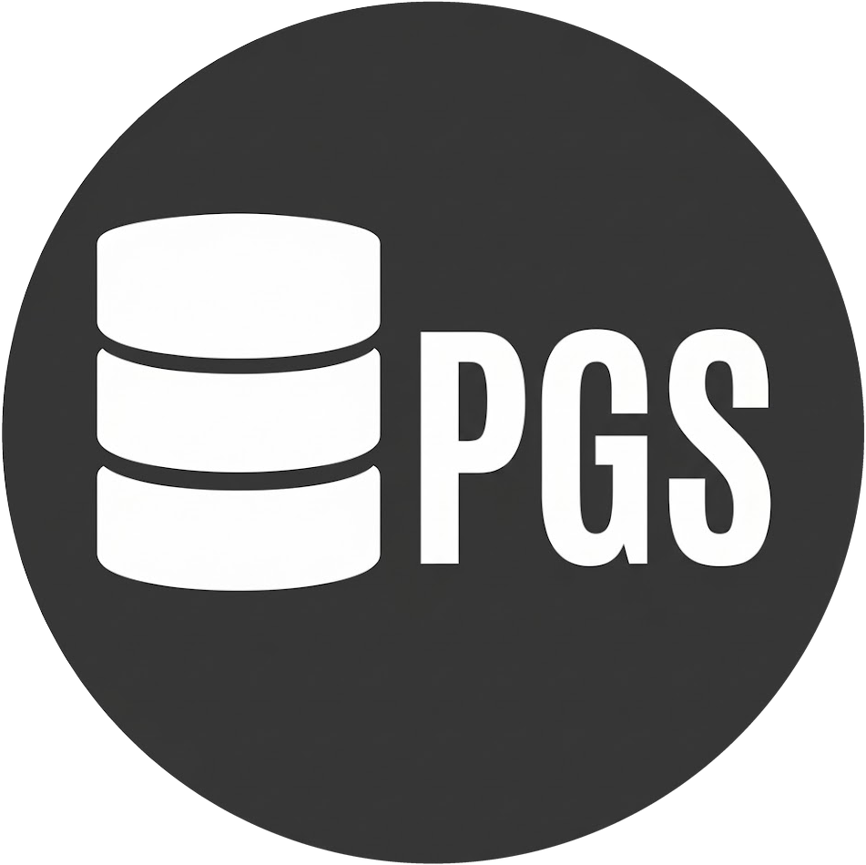

<div align="center">



# pgStudio — Modern PostgreSQL Developer Studio


**A modern, ultra-fast web-based PostgreSQL developer studio & GUI client.**  
Built with **React 19 + TypeScript** and an ultra-lightweight, high-performance **Golang (Gin + pgx v5)** backend engine.

[](https://github.com/akmallxx/pgStudio/releases)
[](https://github.com/akmallxx/pgStudio)
[](https://github.com/akmallxx/pgStudio)
[](https://golang.org)
[](https://react.dev)
[](https://www.typescriptlang.org/)
[](https://www.postgresql.org/)
[](LICENSE)

[Download Rilis](#-unduh-rilis-pre-built-zero-setup) • [Fitur Utama](#-fitur-utama) • [Instalasi & Menjalankan](#-instalasi--menjalankan) • [Arsitektur](#-arsitektur) • [Dokumentasi Fitur](#-dokumentasi-fitur-lengkap) • [SSH Tunneling](#-ssh-bastion-tunneling) • [Konfigurasi](#-konfigurasi)

</div>

---

## 📖 Tentang pgStudio

**pgStudio** dirancang sebagai alternatif modern, ringan, dan elegan untuk *DBeaver* dan *pgAdmin*. Berbeda dengan aplikasi desktop tradisional berbasis Java atau Electron yang berat dan boros resource, pgStudio berjalan sebagai **single binary Go** yang sangat hemat memori (< 35MB RAM) dengan antarmuka web modern bernuansa *Dark IDE theme* yang responsif, intuitif, dan cepat.

pgStudio menghubungkan developer secara langsung ke PostgreSQL lokal maupun cloud (AWS RDS, Supabase, Neon, GCP Cloud SQL, Railway, VPS, dll.) melalui koneksi langsung maupun **SSH Bastion Tunnel**, dilengkapi pool koneksi berkinerja tinggi serta isolasi session database yang aman.

---

## ✨ Fitur Utama

- 📈 **Real-time Database Telemetry & Overview (`/overview`)**:
  - Live metric cards: Ukuran database (`pg_database_size`), Active Connections vs Max Pool (`pg_stat_activity`), Cache Hit Ratio (`pg_stat_database`), Session PID, dan Transaction Isolation Level.
  - Ringkasan katalog tabel nyata dari `pg_stat_user_tables` dengan estimasi jumlah baris dan alokasi disk.
  - Telemetri query terkini (*Recent Executions*) lengkap dengan status, durasi milidetik, baris terdampak, dan tombol eksekusi ulang.
  - Dynamic Code Snippet Generator: Menghasilkan kode koneksi instan untuk **Prisma**, **Node.js (`pg`)**, **Python (`SQLAlchemy / psycopg3`)**, dan **`psql` CLI** secara otomatis berdasarkan profile database aktif.

- 📊 **Table Data Grid & CRUD Editor (`/tables/:tableName`)**:
  - Grid data interaktif dengan pagination, sorting multi-kolom, dan pencarian cepat.
  - Tambah baris (*Insert Row*), edit baris (*Inline Edit* dengan deteksi otomatis Primary Key), dan hapus baris (*Single / Bulk Delete*).
  - Wizard *Add Column* (`ALTER TABLE ADD COLUMN`) dengan pratinjau DDL langsung.
  - Tiga sub-view: **Data Grid View**, **Schema Structure**, dan **Definition DDL**.

- 🗂️ **Database Explorer & Create Table**:
  - Navigasi pohon hierarki database yang bersih dan minimalis: skema, tabel, view, dan fungsi.
  - **Create Table Builder Visual**: Buat tabel baru langsung dari sidebar dengan 9 kategori tipe data PostgreSQL lengkap (`BIGSERIAL`, `UUID`, `TIMESTAMPTZ`, `JSONB`, `NUMERIC`, `TEXT[]`, dll.) serta opsi custom/enum.
  - Template preset siap pakai: *Standard Entity*, *Users & Auth*, *Products*, *Audit Logs*, dan *Blank*.
  - Pratinjau *Live DDL SQL* sebelum eksekusi dengan eksekusi aman dalam transaksi `BEGIN ... COMMIT`.

- 🕸️ **Interactive ERD & FK Dependency Matrix (`/erd`)**:
  - Canvas diagram relasi tabel interaktif dengan panning, zooming, minimap, dan auto-layout.
  - Garis relasi dinamis ortogonal dengan notasi *Crow's Foot* (`1:N`, `0..1`, dan relasi *self-reference*).
  - Panel **Table Inspector**: Menampilkan statistik ukuran tabel, *live tuples*, *dead tuples*, serta daftar foreign key *inbound* dan *outbound*.
  - **FK Dependency Matrix**: Pemetaan matriks 2D ketergantungan antar-tabel dengan tombol salin constraint SQL.
  - **DDL Script Generator**: Ekspor skema database ke file `.sql` atau salin DDL instan.

- ⚡ **SQL Scratchpad & EXPLAIN Runner (`/sql`)**:
  - Editor SQL multi-tab dengan auto-completion dan format query.
  - Analisis rencana eksekusi visual: **EXPLAIN** dan **EXPLAIN ANALYZE** dengan metrik cost dan duration scan.
  - Riwayat query persisten (*Query History*) hingga 50+ eksekusi terakhir dengan metrik durasi dan status.

- 🏎️ **Performance Cockpit (`/performance`)**:
  - Monitoring sesi aktif `pg_stat_activity` secara real-time.
  - Tombol **Terminate Session** untuk membatalkan query yang macet atau mengalami lock.
  - Metrik *Cache Hit Ratio*, *Transactions per Second*, dan pelacakan *Slow Queries*.

- 🔌 **Fleet Multi-Connection Manager & SSH Tunneling (`/connections`)**:
  - Kelola banyak profil koneksi PostgreSQL (*Local*, *Staging*, *Replica*, *Production*).
  - **SSH Bastion Tunnel Support**: Hubungkan database di private subnet via SSH Bastion/Jump Host dengan otentikasi Password atau SSH Key / Passphrase serta tombol **Test Tunnel**.
  - **Session & Active Connection Persistence**: Database aktif tersimpan persisten; me-refresh halaman tidak akan mereset koneksi kembali ke default.
  - Opsi SSL Mode lengkap: `disable`, `prefer`, `require`, `verify-ca`, `verify-full`.

- ⚡ **NexusSH DevOps Suite (`/nexussh/*`)**:
  - **Interactive Web Terminal (`/nexussh/terminal`)**: Terminal interaktif berbasis WebSocket PTY (`xterm.js`) dengan sesi multi-host, auto-reconnect, deteksi port pintar, serta eksekusi snippet langsung.
  - **Dual-Pane SFTP Explorer (`/nexussh/sftp`)**: File manager dua sisi (Local vs Remote) dengan sorting multi-kolom (*Sort By Name/Size/Modified*), kolom tanggal modifikasi (*Terakhir Diubah*), fitur **Salin ke Komputer** / **Salin ke Remote** dengan ekspansi direktori `~`, editor teks in-browser, pembuatan direktori (*Mkdir*), dan penghapusan aman.
  - **Hosts Fleet Manager (`/nexussh/hosts`)**: Manajemen server SSH terpusat dengan dukungan Password / Public Key, latency ping tester, tag filter, dan pengelompokan environment (*Production*, *Staging*, *Database*, *Development*, dll.).
  - **DevOps Snippets Library (`/nexussh/snippets`)**: Repositori perintah bash & PostgreSQL praktis (backup/restore `pg_dump`, telemetry, maintenance) dengan satu klik jalankan langsung ke terminal aktif.
  - **Port Forwarding Tunnels (`/nexussh/port-forwarding`)**: Manajemen tunnel port forwarding lokal & remote dengan toggle aktif/nonaktif instan.

- 🖥️ **Real-time Status Bar**:
  - Bar status bawah aplikasi yang terus ter-update secara otomatis: PostgreSQL version, active database, session backend PID, live disk size, encoding, isolation level, dan query latency.

## 📦 Unduh Rilis Pre-Built (Zero-Setup)

Bagi pengguna yang ingin langsung memakai pgStudio tanpa perlu menginstall Node.js, npm, ataupun compiler Go:

1. Kunjungi halaman **[GitHub Releases](https://github.com/akmallxx/pgStudio/releases)**.
2. Unduh paket binary sesuai sistem operasi Anda:
   - 🪟 **Windows 10 / 11 / Windows Server**: `pgstudio-vX.X.X-windows-amd64.zip`
   - 🐧 **Linux x86_64 (Ubuntu / Debian / CentOS / dll)**: `pgstudio-vX.X.X-linux-amd64.tar.gz`
   - 🍓 **Linux ARM64 (Raspberry Pi / Oracle Cloud ARM)**: `pgstudio-vX.X.X-linux-arm64.tar.gz`

### 🪟 Panduan Pengguna Windows
1. Ekstrak file zip yang telah diunduh ke direktori pilihan Anda.
2. Jalankan aplikasi:
   - **Opsi A**: Klik ganda `start.bat` (menjalankan server dan otomatis membuka browser).
   - **Opsi B**: Klik ganda `start-hidden.vbs` (menjalankan server di latar belakang tanpa jendela command prompt).
3. Browser akan otomatis terbuka di `http://localhost:28432`.
4. **Instal sebagai Desktop App (PWA)**:
   - Klik tombol **"Install App"** berwarna hijau di header atau ikon install di address bar Chrome / Microsoft Edge.
   - Aplikasi akan otomatis memiliki shortcut di Desktop & Start Menu serta berjalan di jendela mandiri tanpa browser bar.

---

## 🚀 Instalasi & Menjalankan dari Source

### 1. Prasyarat (Untuk Developer)
- **Node.js** (v18 ke atas) & **npm**
- **Go** (v1.22 ke atas) *(hanya jika mengompilasi backend dari source)*
- Database **PostgreSQL** aktif (v12 – v17+)

---

### 2. Quick Start (Build & Run Otomatis)

Clone repositori dan gunakan script build bawaan:

```bash
git clone https://github.com/username/database-studio.git
cd database-studio

# Berikan izin eksekusi pada script build
chmod +x build.sh

# Build frontend React dan compile Go server
./build.sh

# Jalankan server pgStudio
./pgstudio-server
```

Buka browser Anda di:
👉 **`http://localhost:28432`**

---

### 3. Menjalankan dalam Mode Pengembangan (Development)

Jika Anda ingin melakukan pengembangan atau modifikasi kode:

#### Terminal 1: Backend Go
```bash
cd backend-go
go run main.go
# Backend aktif di port 28432 (default)
```

#### Terminal 2: Frontend Vite
```bash
npm install
npm run dev
```

Akses frontend Vite dev server (otomatis mem-proxy request API ke port 28432).

---

### 4. Menjalankan Otomatis saat Startup (Systemd Service di Linux/Ubuntu)

pgStudio dapat dikonfigurasi agar berjalan di latar belakang (*background daemon*) dan aktif otomatis saat sistem dinyalakan (*start-up*). Anda dapat memilih salah satu metode di bawah ini:

#### 🟢 Metode A: Systemd User Service (Direkomendasikan — Tanpa Butuh `sudo`)

Metode ini ideal untuk penggunaan pribadi di laptop/PC Linux, tidak memerlukan hak akses `root`/`sudo`, dan tetap otomatis aktif saat sistem *booting* menggunakan fitur *lingering*.

1. **Buat direktori systemd user** (jika belum ada):
   ```bash
   mkdir -p ~/.config/systemd/user
   ```

2. **Buat file unit service**:
   ```bash
   nano ~/.config/systemd/user/pgstudio.service
   ```
   Isi dengan konfigurasi berikut (sesuaikan path direktori jika berbeda):
   ```ini
   [Unit]
   Description=pgStudio PostgreSQL Developer Studio Service
   After=network.target

   [Service]
   Type=simple
   WorkingDirectory=%h/.pgstudio
   ExecStart=%h/.pgstudio/pgstudio-server
   Restart=always
   RestartSec=5

   EnvironmentFile=%h/.pgstudio/.env
   Environment=GIN_MODE=release

   [Install]
   WantedBy=default.target
   ```
   *(Keterangan: `%h` adalah penanda otomatis direktori home user, misal `/home/azahwa`)*

3. **Aktifkan lingering agar service berjalan otomatis saat booting (sebelum login)**:
   ```bash
   loginctl enable-linger $USER
   ```

4. **Reload daemon, aktifkan, dan jalankan service**:
   ```bash
   systemctl --user daemon-reload
   systemctl --user enable --now pgstudio
   ```

5. **Cek status service**:
   ```bash
   systemctl --user status pgstudio
   ```

---

#### 🔵 Metode B: Systemd System Service (Global Service dengan `sudo`)

Gunakan metode ini jika Anda menjalankan pgStudio pada server VPS headless multi-user.

1. **Sesuaikan path di `pgstudio.service`**:
   Buka file [pgstudio.service](file:///home/azahwa/.pgstudio/pgstudio.service) di root proyek dan pastikan direktori `User`, `WorkingDirectory`, `ExecStart`, dan `EnvironmentFile` sesuai dengan lokasi repositori di server Anda.

2. **Salin konfigurasi service ke direktori systemd**:
   ```bash
   sudo cp pgstudio.service /etc/systemd/system/
   ```

3. **Reload daemon, aktifkan, dan jalankan service**:
   ```bash
   sudo systemctl daemon-reload
   sudo systemctl enable --now pgstudio
   ```

4. **Cek status service**:
   ```bash
   sudo systemctl status pgstudio
   ```

---

#### 📋 Perintah Cepat Pengelolaan Service

| Perintah | Mode User (Tanpa `sudo`) | Mode System (Dengan `sudo`) |
|---|---|---|
| **Cek Status** | `systemctl --user status pgstudio` | `sudo systemctl status pgstudio` |
| **Restart Service** | `systemctl --user restart pgstudio` | `sudo systemctl restart pgstudio` |
| **Hentikan Service** | `systemctl --user stop pgstudio` | `sudo systemctl stop pgstudio` |
| **Lihat Log Real-time** | `journalctl --user -u pgstudio -f` | `sudo journalctl -u pgstudio -f` |
| **Nonaktifkan Autostart**| `systemctl --user disable pgstudio` | `sudo systemctl disable pgstudio` |

---

## 🏗️ Arsitektur Proyek

```
database-studio/
├── src/                          # 🎨 Frontend (React 19 + TypeScript + Tailwind)
│   ├── components/               # Komponen pgStudio Database GUI
│   │   ├── DatabaseOverview/     # Telemetri Real-time, Catalog & Dynamic Snippets
│   │   ├── TableEditor/          # CRUD Grid, Data Viewer, Insert/Edit Modal
│   │   ├── SchemaErd/            # Interactive ERD, FK Matrix, DDL Exporter
│   │   ├── SqlEditor/            # SQL Scratchpad & EXPLAIN Visualizer
│   │   ├── PerformanceCockpit/   # pg_stat_activity & Session Monitor
│   │   ├── FleetConnections/     # Connection Manager Profiles
│   │   ├── Sidebar.tsx           # Database Explorer & Tree Navigator
│   │   ├── StatusBar.tsx         # Real-time Telemetry Bottom Bar
│   │   └── Header.tsx            # Global Navbar, Search & Suite Switcher
│   ├── nexussh/                  # ⚡ NexusSH SSH & Server DevOps Suite
│   │   ├── components/
│   │   │   ├── hosts/            # Hosts Fleet Manager
│   │   │   ├── terminal/         # Xterm.js Interactive Web Terminal & PTY
│   │   │   ├── sftp/             # Dual-Pane SFTP File Browser & In-Browser Editor
│   │   │   ├── snippets/         # DevOps & Bash Snippets Library
│   │   │   └── tunnels/          # SSH Port Forwarding Rules
│   │   └── NexusSHView.tsx       # NexusSH Suite Root & View Router
│   ├── services/
│   │   └── api.ts                # Client API Service (REST HTTP & WebSocket URL)
│   └── App.tsx                   # Dual-Suite Orchestrator & App Routing
│
├── backend-go/                   # ⚡ Backend Engine (Golang + Gin + pgx v5 + crypto/ssh)
│   ├── data/                     # Persistent JSON Storage
│   │   ├── connections.json      # Profil Koneksi Database & Konfigurasi SSH
│   │   ├── settings.json         # Konfigurasi Preferensi Studio
│   │   ├── sessions.json         # Persistensi Sesi Login Token Pengguna
│   │   ├── query_history.json    # Histori Query SQL
│   │   ├── ssh_hosts.json        # Database Server SSH NexusSH
│   │   ├── ssh_snippets.json     # Koleksi Snippet Bash & Script
│   │   └── ssh_tunnels.json      # Konfigurasi Port Forwarding Tunnels
│   ├── sftp_terminal.go          # SFTP Engine, WebSocket Terminal PTY & Streaming
│   ├── go.mod
│   └── main.go                   # Single-binary High-Performance Server
│
├── build.sh                      # Universal 1-Click Build Script
├── pgstudio.service              # Linux Systemd Service Daemon Config
└── vite.config.ts                # Vite Bundler Configuration
```

---

## 🛡️ SSH Bastion Tunneling

pgStudio mendukung koneksi ke database di dalam VPC atau private network menggunakan SSH Jump Host / Bastion:

1. Buka menu **Connections** (`/connections`) dan klik **+ Add Connection** atau **Edit**.
2. Pada tab **SSH Tunnel**:
   - Aktifkan toggle **Enable SSH Tunnel**.
   - Masukkan **SSH Host**, **Port** (default: `22`), dan **Username**.
   - Pilih metode otentikasi: **Password** atau **SSH Private Key** (dengan opsional Passphrase).
   - Klik tombol **Test Tunnel Connection** untuk memverifikasi koneksi SSH sebelum menyimpan.
3. Backend Go akan menginisialisasi tunnel socket aman secara transparan ke endpoint PostgreSQL target.

---

## 🧩 Dokumentasi Fitur Lengkap

### 1. Database Overview (`/overview`)
- Menampilkan dashboard live status database aktif.
- Menyediakan connection string siap pakai untuk Prisma ORM, Node.js (`pg`), Python (`SQLAlchemy`), dan `psql` CLI yang terisi otomatis sesuai host, port, username, dan database yang sedang dibuka.
- Menampilkan daftar tabel katalog dengan ukuran data riil dan tombol akses cepat ke Table Editor.

### 2. Table Data Grid & CRUD Editor
- Pilih tabel dari sidebar untuk membuka grid data baris.
- **Insert Row**: Form dinamis yang menyesuaikan tipe data kolom PostgreSQL.
- **Inline Edit**: Klik ikon pensil untuk mengubah data langsung dengan deteksi Primary Key.
- **Bulk Delete**: Centang baris yang ingin dihapus untuk eksekusi penghapusan sekaligus.
- **Add Column Wizard**: Tambah kolom baru dengan tipe data, nullability, dan default value tanpa perlu menulis DDL manual.

### 3. Diagram Relasi ERD & Foreign Key Matrix (`/erd`)
- **Interactive ERD** (`?mode=erd`): Canvas diagram relasi dengan dukungan panning, zooming, minimap, dan auto-layout.
- **Schema Tables** (`?mode=schema`): Ringkasan seluruh tabel dalam skema.
- **FK Matrix** (`?mode=matrix`): Matriks relasi 2D foreign key antar-tabel.
- **DDL Script** (`?mode=ddl`): Export skema DDL lengkap ke file `.sql`.

### 4. SQL Scratchpad & EXPLAIN Runner (`/sql`)
- Jalankan query SQL mentah dengan shortcut `Ctrl + Enter`.
- Gunakan tombol **Explain Plan** untuk visualisasi biaya (*cost*) dan efisiensi scan query.
- Riwayat query tersimpan otomatis ke history dan dapat dijalankan kembali kapan saja.

### 5. NexusSH DevOps Suite (`/nexussh/*` atau `/terminal`, `/sftp`)
- **Interactive Web Terminal (`/nexussh/terminal`)**:
  - Emulasi terminal VT100/xterm interaktif berbasis `xterm.js` dengan koneksi langsung ke PTY server Go melalui WebSocket.
  - Multi-tab session: Buka dan kelola banyak sesi terminal sekaligus tanpa reload.
  - Auto-reconnect & direct-port fallback jika reverse proxy lokal tidak meneruskan WebSocket.
  - Eksekusi cepat: Klik ikon Play pada snippet di sidebar untuk mengeksekusi script langsung ke terminal aktif.
- **Dual-Pane SFTP Explorer (`/nexussh/sftp`)**:
  - Navigasi dua arah: Explorer Lokal (komputer Anda) di sisi kiri dan Explorer Remote (server SSH) di sisi kanan.
  - Sorting fleksibel: Klik header tabel (**Nama**, **Ukuran**, atau **Terakhir Diubah**) untuk mengurutkan file secara ascending/descending.
  - Tombol **Salin ke Komputer**: Menyalin file atau folder langsung dari remote ke path lokal aktif (dengan dukungan ekspansi tilde `~`).
  - Tombol **Salin ke Remote**: Menyalin file dari direktori lokal langsung ke server remote.
  - **In-Browser Code Editor**: Pratinjau dan edit file teks/skrip konfigurasi di remote dengan syntax highlighting dan tombol simpan langsung.
  - Manajemen berkas lengkap: Buat folder baru (*New Folder*), ganti nama (*Rename*), dan hapus berkas (*Delete*).
- **Hosts Fleet Manager (`/nexussh/hosts`)**:
  - Simpan dan kelola kredensial server SSH (IP/Hostname, Port, User, Password / Private Key).
  - Ping latency tester dan pengelompokan environment (*Production*, *Staging*, *Database*, *Development*, dll.).
- **DevOps Snippets Library (`/nexussh/snippets`)**:
  - Simpan template perintah bash berulang seperti dump database, health check, update service, dan monitoring.

---

## 🌐 Konfigurasi Reverse Proxy (Apache / Nginx)

Jika Anda menjalankan pgStudio di belakang reverse proxy seperti Apache VirtualHost atau Nginx (misalnya `http://pgstudio.localhost`), pastikan reverse proxy mengizinkan **WebSocket Upgrade** agar Web Terminal berfungsi secara native:

#### Apache (VirtualHost)
Tambahkan konfigurasi `RewriteRule` untuk WebSocket di dalam `<VirtualHost *:80>`:
```apache
<VirtualHost *:80>
    ServerName pgstudio.localhost

    ProxyPreserveHost On
    ProxyRequests Off

    # WebSocket Proxying
    RewriteEngine on
    RewriteCond %{HTTP:Upgrade} websocket [NC]
    RewriteCond %{HTTP:Connection} upgrade [NC]
    RewriteRule ^/?(.*) "ws://localhost:28432/$1" [P,L]

    # Standard HTTP Proxying
    ProxyPass / http://localhost:28432/
    ProxyPassReverse / http://localhost:28432/
</VirtualHost>
```
*Catatan: Pastikan modul Apache aktif dengan menjalankan: `sudo a2enmod proxy_http rewrite` lalu `sudo systemctl reload apache2`.*

#### Nginx
```nginx
location / {
    proxy_pass http://127.0.0.1:28432;
    proxy_http_version 1.1;
    proxy_set_header Upgrade $http_upgrade;
    proxy_set_header Connection "upgrade";
    proxy_set_header Host $host;
}
```

---

## ⚙️ Konfigurasi Environment

Variabel lingkungan yang dapat dikonfigurasi melalui `.env` atau environment variable sistem:

| Variabel | Default | Keterangan |
|---|---|---|
| `PORT` | `28432` | Port listening server pgStudio |
| `USERNAME` | `kotakhitam` | Username login studio |
| `PASSWORD` | `...` | Bcrypt hash password pengguna (atau plaintext) |
| `RATE_LIMIT`| `20` | Batas maksimum request per detik per IP |
| `GIN_MODE` | `release` | Mode Gin engine (`debug` atau `release`) |

---

## 🔒 Keamanan & Praktik Terbaik

- **Identifier Sanitization**: Seluruh identifier SQL tabel dan kolom disanitasi secara ketat untuk mencegah SQL Injection.
- **Transaction Safety**: Eksekusi pembuatan tabel dan modifikasi struktur dibungkus dalam transaksi `BEGIN ... COMMIT` dengan rollback otomatis jika terjadi kegagalan.
- **Query Timeout**: Dilengkapi statement timeout otomatis yang dapat disesuaikan di Settings untuk mencegah lock berkepanjangan pada database production.
- **Production Guard**: Label badge status (`PROD`, `STAGING`, `LOCAL`, `REPLICA`) dengan opsi read-only guard untuk mencegah eksekusi mutasi tidak disengaja.

---

## 📄 Lisensi

Proyek ini dilisensikan di bawah lisensi [MIT](LICENSE).

---

<div align="center">
Dibuat dengan ❤️ untuk developer PostgreSQL.
</div>
