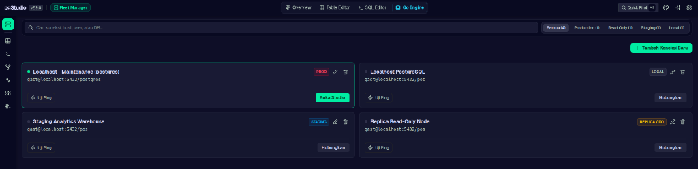

# 🐘 pgStudio — Modern PostgreSQL Developer Studio

<div align="center">



**A modern, ultra-fast web-based PostgreSQL developer studio & GUI client.**  
Built with **React 19 + TypeScript** and an ultra-lightweight, high-performance **Golang (Gin + pgx v5)** backend engine.

[](https://golang.org)
[](https://react.dev)
[](https://www.typescriptlang.org/)
[](https://www.postgresql.org/)
[](LICENSE)

[Fitur Utama](#-fitur-utama) • [Instalasi & Menjalankan](#-instalasi--menjalankan) • [Arsitektur](#-arsitektur) • [Dokumentasi Fitur](#-dokumentasi-fitur-lengkap) • [SSH Tunneling](#-ssh-bastion-tunneling) • [Konfigurasi](#-konfigurasi)

</div>

---

## 📖 Tentang pgStudio

**pgStudio** dirancang sebagai alternatif modern, ringan, dan elegan untuk *DBeaver* dan *pgAdmin*. Berbeda dengan aplikasi desktop tradisional berbasis Java atau Electron yang berat dan boros resource, pgStudio berjalan sebagai **single binary Go** yang sangat hemat memori (< 35MB RAM) dengan antarmuka web modern bernuansa *Dark IDE theme* yang responsif, intuitif, dan cepat.

pgStudio menghubungkan developer secara langsung ke PostgreSQL lokal maupun cloud (AWS RDS, Supabase, Neon, GCP Cloud SQL, Railway, VPS, dll.) melalui koneksi langsung maupun **SSH Bastion Tunnel**, dilengkapi pool koneksi berkinerja tinggi serta isolasi session database yang aman.

---

## ✨ Fitur Utama

- 📈 **Real-time Database Telemetry & Overview (`/overview`)**:
  - Live metric cards: Ukuran database (`pg_database_size`), Active Connections vs Max Pool (`pg_stat_activity`), Cache Hit Ratio (`pg_stat_database`), Session PID, dan Transaction Isolation Level.
  - Ringkasan katalog tabel nyata dari `pg_stat_user_tables` dengan estimasi jumlah baris dan alokasi disk.
  - Telemetri query terkini (*Recent Executions*) lengkap dengan status, durasi milidetik, baris terdampak, dan tombol eksekusi ulang.
  - Dynamic Code Snippet Generator: Menghasilkan kode koneksi instan untuk **Prisma**, **Node.js (`pg`)**, **Python (`SQLAlchemy / psycopg3`)**, dan **`psql` CLI** secara otomatis berdasarkan profile database aktif.

- 📊 **Table Data Grid & CRUD Editor (`/tables/:tableName`)**:
  - Grid data interaktif dengan pagination, sorting multi-kolom, dan pencarian cepat.
  - Tambah baris (*Insert Row*), edit baris (*Inline Edit* dengan deteksi otomatis Primary Key), dan hapus baris (*Single / Bulk Delete*).
  - Wizard *Add Column* (`ALTER TABLE ADD COLUMN`) dengan pratinjau DDL langsung.
  - Tiga sub-view: **Data Grid View**, **Schema Structure**, dan **Definition DDL**.

- 🗂️ **Database Explorer & Create Table**:
  - Navigasi pohon hierarki database yang bersih dan minimalis: skema, tabel, view, dan fungsi.
  - **Create Table Builder Visual**: Buat tabel baru langsung dari sidebar dengan 9 kategori tipe data PostgreSQL lengkap (`BIGSERIAL`, `UUID`, `TIMESTAMPTZ`, `JSONB`, `NUMERIC`, `TEXT[]`, dll.) serta opsi custom/enum.
  - Template preset siap pakai: *Standard Entity*, *Users & Auth*, *Products*, *Audit Logs*, dan *Blank*.
  - Pratinjau *Live DDL SQL* sebelum eksekusi dengan eksekusi aman dalam transaksi `BEGIN ... COMMIT`.

- 🕸️ **Interactive ERD & FK Dependency Matrix (`/erd`)**:
  - Canvas diagram relasi tabel interaktif dengan panning, zooming, minimap, dan auto-layout.
  - Garis relasi dinamis ortogonal dengan notasi *Crow's Foot* (`1:N`, `0..1`, dan relasi *self-reference*).
  - Panel **Table Inspector**: Menampilkan statistik ukuran tabel, *live tuples*, *dead tuples*, serta daftar foreign key *inbound* dan *outbound*.
  - **FK Dependency Matrix**: Pemetaan matriks 2D ketergantungan antar-tabel dengan tombol salin constraint SQL.
  - **DDL Script Generator**: Ekspor skema database ke file `.sql` atau salin DDL instan.

- ⚡ **SQL Scratchpad & EXPLAIN Runner (`/sql`)**:
  - Editor SQL multi-tab dengan auto-completion dan format query.
  - Analisis rencana eksekusi visual: **EXPLAIN** dan **EXPLAIN ANALYZE** dengan metrik cost dan duration scan.
  - Riwayat query persisten (*Query History*) hingga 50+ eksekusi terakhir dengan metrik durasi dan status.

- 🏎️ **Performance Cockpit (`/performance`)**:
  - Monitoring sesi aktif `pg_stat_activity` secara real-time.
  - Tombol **Terminate Session** untuk membatalkan query yang macet atau mengalami lock.
  - Metrik *Cache Hit Ratio*, *Transactions per Second*, dan pelacakan *Slow Queries*.

- 🔌 **Fleet Multi-Connection Manager & SSH Tunneling (`/connections`)**:
  - Kelola banyak profil koneksi PostgreSQL (*Local*, *Staging*, *Replica*, *Production*).
  - **SSH Bastion Tunnel Support**: Hubungkan database di private subnet via SSH Bastion/Jump Host dengan otentikasi Password atau SSH Key / Passphrase serta tombol **Test Tunnel**.
  - **Session & Active Connection Persistence**: Database aktif tersimpan persisten; me-refresh halaman tidak akan mereset koneksi kembali ke default.
  - Opsi SSL Mode lengkap: `disable`, `prefer`, `require`, `verify-ca`, `verify-full`.

- 🖥️ **Real-time Status Bar**:
  - Bar status bawah aplikasi yang terus ter-update secara otomatis: PostgreSQL version, active database, session backend PID, live disk size, encoding, isolation level, dan query latency.

---

## 🚀 Instalasi & Menjalankan

### 1. Prasyarat
- **Node.js** (v18 ke atas) & **npm**
- **Go** (v1.22 ke atas) *(hanya jika mengompilasi backend dari source)*
- Database **PostgreSQL** aktif (v12 – v17+)

---

### 2. Quick Start (Build & Run Otomatis)

Clone repositori dan gunakan script build bawaan:

```bash
git clone https://github.com/username/database-studio.git
cd database-studio

# Berikan izin eksekusi pada script build
chmod +x build.sh

# Build frontend React dan compile Go server
./build.sh

# Jalankan server pgStudio
./pgstudio-server
```

Buka browser Anda di:
👉 **`http://localhost:28432`**

---

### 3. Menjalankan dalam Mode Pengembangan (Development)

Jika Anda ingin melakukan pengembangan atau modifikasi kode:

#### Terminal 1: Backend Go
```bash
cd backend-go
go run main.go
# Backend aktif di port 28432 (default)
```

#### Terminal 2: Frontend Vite
```bash
npm install
npm run dev
```

Akses frontend Vite dev server (otomatis mem-proxy request API ke port 28432).

---

### 4. Menjalankan sebagai Systemd Service (Linux/Ubuntu)

File `pgstudio.service` sudah disediakan di root direktori untuk menjalankan pgStudio sebagai background daemon otomatis:

```bash
# Salin konfigurasi service ke systemd
sudo cp pgstudio.service /etc/systemd/system/

# Reload systemd daemon
sudo systemctl daemon-reload

# Aktifkan dan jalankan service
sudo systemctl enable --now pgstudio

# Cek status service
sudo systemctl status pgstudio
```

---

## 🏗️ Arsitektur Proyek

```
database-studio/
├── src/                          # 🎨 Frontend (React 19 + TypeScript + Tailwind)
│   ├── components/
│   │   ├── DatabaseOverview/     # Telemetri Real-time, Catalog & Dynamic Snippets
│   │   ├── TableEditor/          # CRUD Grid, Data Viewer, Insert/Edit Modal
│   │   │   ├── CreateTableModal  # Visual PostgreSQL Table Creator
│   │   │   └── InsertColumnModal # ALTER TABLE Column Adder
│   │   ├── SchemaErd/            # Interactive ERD, FK Matrix, DDL Exporter
│   │   ├── SqlEditor/            # SQL Scratchpad & EXPLAIN Visualizer
│   │   ├── PerformanceCockpit/   # pg_stat_activity & Session Monitor
│   │   ├── FleetConnections/     # Connection Manager Profiles
│   │   ├── ConnectionSettingsModal # Form Koneksi DB, Tab SSH Tunnel & Advanced
│   │   ├── StudioSettingsModal/  # Pengaturan Global Studio (Timeout, Theme, Catalog)
│   │   ├── Sidebar.tsx           # Database Explorer & Tree Navigator
│   │   ├── StatusBar.tsx         # Real-time Telemetry Bottom Bar
│   │   └── Header.tsx            # Global Navbar, Search & Database Switcher
│   ├── services/
│   │   └── api.ts                # Client API Service (REST HTTP)
│   └── App.tsx                   # Main Routing & Modal Orchestrator
│
├── backend-go/                   # ⚡ Backend Engine (Golang + Gin + pgx v5)
│   ├── data/                     # Persistent JSON Storage
│   │   ├── connections.json      # Profil Koneksi Database & Konfigurasi SSH
│   │   ├── settings.json         # Konfigurasi Preferensi Studio
│   │   └── query_history.json    # Histori Query SQL
│   ├── go.mod
│   └── main.go                   # Single-file High-Performance Microservice
│
├── build.sh                      # Universal 1-Click Build Script
├── pgstudio.service              # Linux Systemd Service Daemon Config
└── vite.config.ts                # Vite Bundler Configuration
```

---

## 🛡️ SSH Bastion Tunneling

pgStudio mendukung koneksi ke database di dalam VPC atau private network menggunakan SSH Jump Host / Bastion:

1. Buka menu **Connections** (`/connections`) dan klik **+ Add Connection** atau **Edit**.
2. Pada tab **SSH Tunnel**:
   - Aktifkan toggle **Enable SSH Tunnel**.
   - Masukkan **SSH Host**, **Port** (default: `22`), dan **Username**.
   - Pilih metode otentikasi: **Password** atau **SSH Private Key** (dengan opsional Passphrase).
   - Klik tombol **Test Tunnel Connection** untuk memverifikasi koneksi SSH sebelum menyimpan.
3. Backend Go akan menginisialisasi tunnel socket aman secara transparan ke endpoint PostgreSQL target.

---

## 🧩 Dokumentasi Fitur Lengkap

### 1. Database Overview (`/overview`)
- Menampilkan dashboard live status database aktif.
- Menyediakan connection string siap pakai untuk Prisma ORM, Node.js (`pg`), Python (`SQLAlchemy`), dan `psql` CLI yang terisi otomatis sesuai host, port, username, dan database yang sedang dibuka.
- Menampilkan daftar tabel katalog dengan ukuran data riil dan tombol akses cepat ke Table Editor.

### 2. Table Data Grid & CRUD Editor
- Pilih tabel dari sidebar untuk membuka grid data baris.
- **Insert Row**: Form dinamis yang menyesuaikan tipe data kolom PostgreSQL.
- **Inline Edit**: Klik ikon pensil untuk mengubah data langsung dengan deteksi Primary Key.
- **Bulk Delete**: Centang baris yang ingin dihapus untuk eksekusi penghapusan sekaligus.
- **Add Column Wizard**: Tambah kolom baru dengan tipe data, nullability, dan default value tanpa perlu menulis DDL manual.

### 3. Diagram Relasi ERD & Foreign Key Matrix (`/erd`)
- **Interactive ERD** (`?mode=erd`): Canvas diagram relasi dengan dukungan panning, zooming, minimap, dan auto-layout.
- **Schema Tables** (`?mode=schema`): Ringkasan seluruh tabel dalam skema.
- **FK Matrix** (`?mode=matrix`): Matriks relasi 2D foreign key antar-tabel.
- **DDL Script** (`?mode=ddl`): Export skema DDL lengkap ke file `.sql`.

### 4. SQL Scratchpad & EXPLAIN Runner (`/sql`)
- Jalankan query SQL mentah dengan shortcut `Ctrl + Enter`.
- Gunakan tombol **Explain Plan** untuk visualisasi biaya (*cost*) dan efisiensi scan query.
- Riwayat query tersimpan otomatis ke history dan dapat dijalankan kembali kapan saja.

---

## ⚙️ Konfigurasi Environment

Variabel lingkungan yang dapat dikonfigurasi melalui `.env` atau environment variable sistem:

| Variabel | Default | Keterangan |
|---|---|---|
| `PORT` | `28432` | Port listening server pgStudio |
| `GIN_MODE` | `release` | Mode Gin engine (`debug` atau `release`) |

---

## 🔒 Keamanan & Praktik Terbaik

- **Identifier Sanitization**: Seluruh identifier SQL tabel dan kolom disanitasi secara ketat untuk mencegah SQL Injection.
- **Transaction Safety**: Eksekusi pembuatan tabel dan modifikasi struktur dibungkus dalam transaksi `BEGIN ... COMMIT` dengan rollback otomatis jika terjadi kegagalan.
- **Query Timeout**: Dilengkapi statement timeout otomatis yang dapat disesuaikan di Settings untuk mencegah lock berkepanjangan pada database production.
- **Production Guard**: Label badge status (`PROD`, `STAGING`, `LOCAL`, `REPLICA`) dengan opsi read-only guard untuk mencegah eksekusi mutasi tidak disengaja.

---

## 📄 Lisensi

Proyek ini dilisensikan di bawah lisensi [MIT](LICENSE).

---

<div align="center">
Dibuat dengan ❤️ untuk developer PostgreSQL.
</div>
